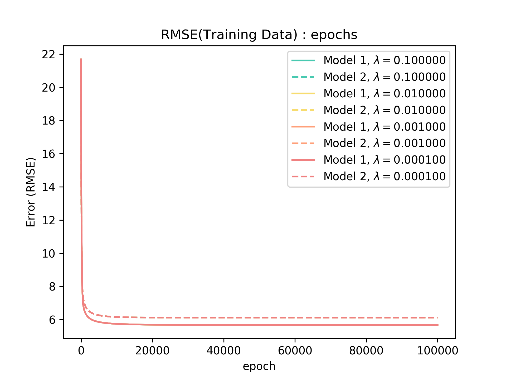

## Machine Learning 2019 Spring - HW1 Report

<h6 style="text-align: right">學號：B06902029	系級：資工二	姓名：裴梧鈞</h6>

請實做以下兩種不同feature的模型，回答第 (1) ~ (3) 題：

1.  抽全部9小時內的污染源feature當作一次項(加bias)
2.  抽全部9小時內pm2.5的一次項當作feature(加bias)

備註 : 
	a. NR請皆設為0，其他的數值不要做任何更動
	b. 所有 advanced 的 gradient descent 技術(如: adam, adagrad 等) 都是可以用的
	c. 第1-3題請都以題目給訂的兩種model來回答
	d. 同學可以先把model訓練好，kaggle死線之後便可以無限上傳。
	e. 根據助教時間的公式表示，(1) 代表 $p = 9\times18+1$ 而 (2) 代表 $p = 9\times1+1$

>   *以下三題的程式碼皆可在 `hw1/Report` 中找到對應的資料夾進行 reproduce，基本上都有使用 **Adagrad** 以及 **Feature Scaling**，並且把 $\eta$ 設成 $1$， iteration 次數設成 $10^5$，但請仍以實作為主。*

1. **(2%) 記錄誤差值 (RMSE)（根據kaggle public+private分數），討論兩種feature的影響。**

    | Model   | Public  | Private | $E_{in}$ |
    | ------- | ------- | ------- | -------- |
    | Model 1 | 5.64856 | 7.26903 | 5.68107  |
    | Model 2 | 5.90263 | 7.22356 | 6.12302  |

    >   最後一個 column 是 training data 在 training 的最後一個 iteration 做的 RMSE

    ​	Model 2 的 hypothesis set 是包含於 Model 1 的 hypothesis set，所以在 training 的過程中， Model 1 理當可以得到比較好的 training Loss。至於 Kaggle 上的部分，雖然在 public 的部分 Model 1 表現得比較好，但是在 private 的部分 Model 1 卻有更大的 Loss，可見 Model 1 還是 overfit 了。

2. **(1%) 將feature從抽前9小時改成抽前5小時，討論其變化。**

    | Model    | Public  | Private | $E_{in}$ |
    | -------- | ------- | ------- | -------- |
    | Model 1' | 5.96813 | 7.21953 | 5.80596  |
    | Model 2' | 6.22732 | 7.22552 | 6.20700  |

>    最後一個 column 是 training data 在 training 的最後一個 iteration 做的 RMSE
>    為了方便區分，我在這小題的 Model 都多加一點

​	第二小題中的兩個 model 的 hypothesis set 都是第一小題同樣 model 的子集，可以猜想到在 training 過程中，兩者的 training Loss 都會比第一小題的 Model 高。雖然在 kaggle 上 Public set 的表現都不如第一小題，但 Model 1' 在這四種 model 中的表現是最佳的，代表其實只選 5 個小時並不會有明顯的 underfit。

​	比較完這四種 model 後，我又有另外一個大膽的猜測，就是 Public set 的資料與 training data 比較像，而 Private set 的比較不像。

3. **(1%) Regularization on all the weight with $\lambda =0.1, 0.01, 0.001, 0.0001$，並作圖。**

    >   以下表格是由四種 $\lambda​$ 對兩種 Model 在 Kaggle 上得到的成績以及 training 最後一個 epoch 的 Loss。

    | $\lambda$ | Model 1 Public  | Model 1 Private | Model 1 $E_{in}$ | Model 2 Public | Model 2 Private | Model 2 $E_{in}$ |
    | --------- | ------- | ------- | --------- | --------- | --------- | --------- |
    | 0.1       | 5.68359 | 7.26939      | 5.681086     | 5.90305        | 7.22409 | 6.123021 |
    | 0.01      | 5.68341 | 7.26907 | 5.681075         | 5.90267        | 7.22361 | 6.123021 |
    | 0.001     | 5.68339    | 7.26904   | 5.681074         | 5.90263        | 7.22356 | 6.123021 |
    | 0.0001    | 5.68339 | 7.26903   | 5.681073         | 5.90263        | 7.22356 | 6.123021 |

    ​	先從 Model 的 trainging Loss 看起，其實兩種 Model 的 Loss 都是隨著 $\lambda$ 增加而越大，符合我們對於 regularize 的期望。就 Kaggle 上的結果而言，其實差異也並不大，或許 $\lambda$ 的設置要更大一點，才能看出明顯的差距。

    ​	相較於第一小題，regularize後的結果普遍較尚未 regularize 的差但差距不大，我認為可能純粹是因為一點點的誤差造成，無法判斷哪種 $\lambda$ 有較好的表現。

    >   下圖則是在 Training 時，training data 的 RMSE 對 epochs 做圖的結果。

    ​	

    雖然在該圖看不到明顯的差距，但放大後應該可以看到有些微的差距，或許 $\lambda$ 的設置再懸殊一點才能看到明顯的差別。

4. **(1%) 在線性回歸問題中，假設有 $N$ 筆訓練資料，每筆訓練資料的特徵 (feature) 為一向量 $\mathbf{x}^n$，其標註(label)為一純量 $\mathbf{y}^n$，模型參數為一向量 $\mathbf{w}$ (此處忽略偏權值 $\mathbf{b}$)，則線性回歸的損失函數(loss function)為 $\sum_{n = 1}^N (\mathbf{y}^n - \mathbf{x}^n\mathbf{w})^2$。若將所有訓練資料的特徵值以矩陣 $\mathbf{X}=[\mathbf{x}^1\space\mathbf{x}^2\space … \space \mathbf{x}^N]^T$ 表示，所有訓練資料的標註以向量 $\mathbf{y}=[\mathbf{y}^1\space\mathbf{y}^2\space … \space \mathbf{y}^N]^T$ 表示，請問如何以 $\mathbf{X}$ 和 $\mathbf{y}$ 表示可以最小化損失函數的向量 $\mathbf{w}$？請選出正確答案。(其中 $\mathbf{X}^T\mathbf{X}​$ 為invertible)**

    1. $(\mathbf{X}^T\mathbf{X})\mathbf{X}^T\mathbf{y}​$
    2. $(\mathbf{X}^T\mathbf{X})\mathbf{yX}^T​$
    3. $(\mathbf{X}^T\mathbf{X})^{-1}\mathbf{X}^T\mathbf{y}​$
    4. $(\mathbf{X}^T\mathbf{X})^{-1}\mathbf{yX}^T​$

    Ans: (3)
