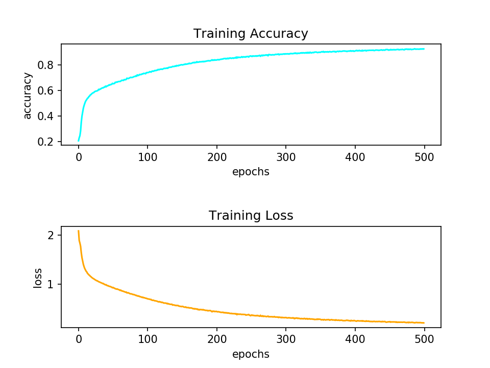
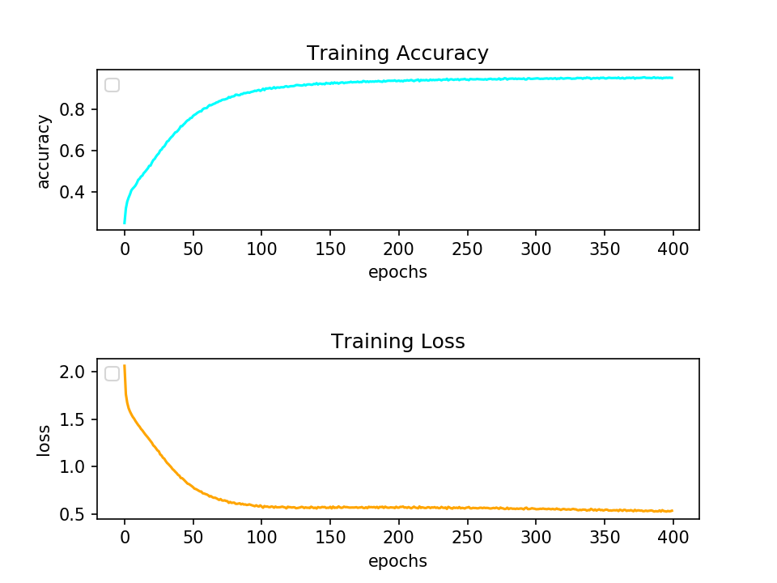
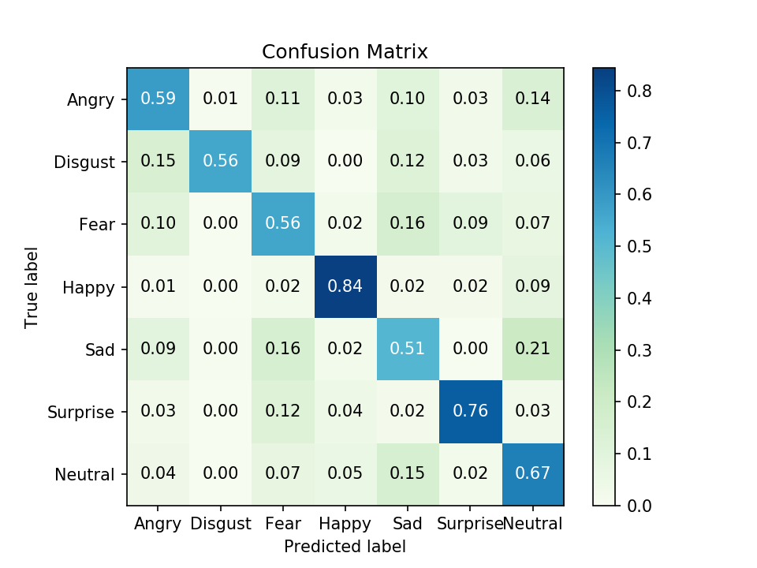

## Machine Learning 2019 Spring - HW3 Report

<h6 style="text-align: right">學號：B06902029	系級：資工二	姓名：裴梧鈞</h6>

1.  (2%) 請說明你實作的 CNN model，其模型架構、訓練參數和準確率為何？並請用與上述 CNN 接近的參數量，實做簡單的 DNN model，同時也說明其模型架構、訓練參數和準確率為何？並說明你觀察到了什麼？

    -   CNN Model 架構

        ```
        Input(48 * 48),
        Conv2D(128, (5, 5)), Conv2D(128, (5, 5)), BatchNormalization, MaxPooling(pool_size = (2, 2)), LeakyReLU(0.3), Dropout(0.1),
        Conv2D(256, (5, 5)), Conv2D(256, (5, 5)), BatchNormalization, MaxPooling(pool_size = (2, 2)), LeakyReLU(0.3), Dropout(0.2),
        Conv2D(512, (3, 3)), Conv2D(512, (3, 3)), BatchNormalization, MaxPooling(pool_size = (2, 2)), LeakyReLU(0.3), Dropout(0.3),
        Conv2D(768, (3, 3)), Conv2D(768, (3, 3)), BatchNormalization, MaxPooling(pool_size = (2, 2)), LeakyReLU(0.3), Dropout(0.4),
        Flatten(),
        Dense(1024), BatchNormalization, ReLU, Dropout(0.5),
        Dense(1024), BatchNormalization, ReLU, Dropout(0.5),
        Dense(512), BatchNormalization, ReLU, Dropout(0.5),
        Dense(512), BatchNormalization, ReLU, Dropout(0.5),
        Dense(7, activation = 'softmax')
        ```

        此外，我也有使用 ImageDataGenerator，包含旋轉 20 度、上下左右平移 0.05 倍邊長以及水平翻轉。Optimizer 方面我使用的是 Adam，epochs 數則是 500。

    -   DNN Model 架構

        ```
        Input(48 * 48), Flatten(),
        Dense(4096), BatchNormalization, ReLU, Dropout(0.5),
        Dense(2048), BatchNormalization, ReLU, Dropout(0.5),
        Dense(2048), BatchNormalization, ReLU, Dropout(0.5),
        Dense(1024), BatchNormalization, ReLU, Dropout(0.5),
        Dense(7, activation = 'softmax')
        ```

        Optimizer 方面我使用的也是 Adam，epochs 數則是 400。

    -   比較

        | Model | Total Params | Trainable Params | Public Score | Private Score |
        | ----- | ------------ | ---------------- | ------------ | ------------- |
        | CNN   | 24,198,535   | 24,189,063       | 0.69044      | 0.67456       |
        | DNN   | 24,170,503   | 24,152,071       | 0.37726      | 0.38060       |

    -   大約相同的參數量，CNN 以及 DNN 就有相當大的差距，這跟上課提到的一樣，並不超出我們的想像。

2.  (1%) 承上題，請分別畫出這兩個model的訓練過程 (i.e., loss/accuracy v.s. epoch)

    |                           CNN                            |                           DNN                            |
    | :------------------------------------------------------: | :------------------------------------------------------: |
    |  |  |

3.  (1%) 請嘗試 data normalization, data augmentation,說明實作方法並且說明實行前後對準確率有什麼樣的影響？

    >   在這題中，我使用的 model 架構就是第一題的架構；只差在有沒有 Normalization 或者 Data Augmentation。為了方便比較，以下三種 model 我都只 train 125 epochs。

    | Model                                         | Validation Accuracy | Public Score | Private Score |
    | --------------------------------------------- | ------------------- | ------------ | ------------- |
    | Raw Data                                      | 0.24800             | 0.25020      | 0.24407       |
    | With Data Normalization                       | 0.63355             | 0.63388      | 0.63360       |
    | With Data Normalization and Data Augmentation | 0.85029             | 0.67846      | 0.66703       |

    和當初預期的一樣，完全沒有 Data Normalization 的 model 是完全 train 不起來的，而有 Data Normalization 後的 model 便可以輕鬆突破 Simple Baseline；在加了 Data Augmentation 之後 雖然還沒有衝過 Strong Baseline，但我想是因為 model 還沒收斂，或許 train 個 200 個 epoch 就可以突破了。

4.   (1%) 觀察答錯的圖片中，哪些 class 彼此間容易用混？[繪出 confusion matrix 分析]

     

     由這張圖可以看出 Angry、Disgust、Fear、Sad 這四類情緒蠻接近的 class 的準確率是比較低的，在 model 的分類都會互相影響一點點；Neutral 也是影響分類的一個 class，或許我的 model 不知道要判斷成什麼就會判給 Neutral。