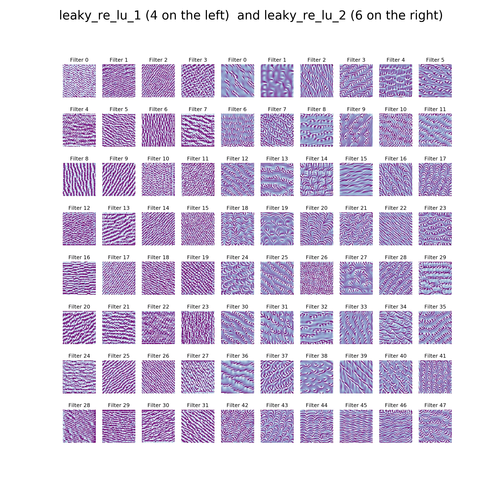

## Machine Learning 2019 Spring - HW4 Report

<h6 style="text-align: right">學號：B06902029	系級：資工二	姓名：裴梧鈞</h6>

1.  **(2%) 從作業三可以發現，使用 CNN 的確有些好處，試繪出其 saliency maps，觀察模型在做 classification 時，是 focus 在圖片的哪些部份？**

    >   在這個部分，我取用圖片的方式是隨機選取 `yPredict == y` 的照片

    | Label (Image Index) |                    Saliency Map                     |
    | :-----------------: | :-------------------------------------------------: |
    |    Angry (19833)     |  |
    |    Disgust (9612)     |  |
    |   Fear (24422) |                         |
    | Happy (28684) |  |
    | Sad (21428) |  |
    | Surprise (2072) |  |
    | Neutral (23216) |  |

    從兩張 Saliency Map 可以看出來有臉型的輪廓，其中我發現眼睛的部分有時候有較明顯的 activation，如「恐懼」，但在「高興」或「驚訝」的兩張圖片則沒有明顯的區域（或許是沒有取到結果會比較明顯的圖片）。

2.  **(3%) 承(1) 利用上課所提到的 gradient ascent 方法，觀察特定層的filter最容易被哪種圖片 activate 與觀察 filter 的 output。**

    1.  Filter 最容易被 activate 的圖片

        

        在這題中，我使用我的第一層 leaky_relu（取 32 個，在左邊 4 個 columns）以及第二層 leaky_relu（取 48 個，在右邊 6 個 columns）。我也有嘗試過使用第一及第二層 convolution layer，只是效果並沒有明顯，於是改使用 leaky_relu。

    2.  Filter 的 Output（使用圖片編號 5607）

        

        相較於上一個小題，在這邊我使用第二個與第四個 convolution layer，倘若使用 leaky_relu 則會因為過 max pooling 而讓輸出的畫質不佳。可以看到 `conv2d_2` 的輸出比 `conv2d_4` 的輸出還更像一個人臉，但 `conv2d_4` 的部分輸出仍然可以看到一些臉的特徵（如眼睛、嘴巴）。

3.  **(3%) 請使用Lime套件分析你的模型對於各種表情的判斷方式，並解釋為何你的模型在某些label表現得特別好 (可以搭配作業三的Confusion Matrix)。**

    >在這個部分，我取用圖片的方式是選取 `yPredict == y` 中 output 最大的照片

    |            0 (Angry)             |             1(Disgust)              |             2(Fear)              |            3(Happy)            |             4(Sad)              |            5(Surprise)             |             6(Neutral)             |
    | :-----------------------------: | :------------------------------: | :------------------------------: | :---------------------------: | :------------------------------: | :----------------------------: | :-----------------------------: |
    |  9956 |  13248 |  15253 |  80 |  25170 |  583 |  1879 |

    在我的 Confusion Matrix 中，Happy 以及 Surprise 是表現最好的兩個 class，分別是 0.84 以及 0.76。Happy 的話可以看到我的 model focus 到的是微笑的嘴型，而這個特徵是這七個裡面蠻獨特的特徵；Surprise 的話可以看出我的 model 看到的是他的眼睛以及張開嘴巴的嘴型，這個嘴型應該也是特屬於 Surprise 這個 class 的。

4.  **(2%)  [自由發揮] 請同學自行搜尋或參考上課曾提及的內容，實作任一種方式來觀察CNN模型的訓練，並說明你的實作方法及呈現visualization的結果。**

    我使用的是 keras vis 中的 visual-cam 來實作視覺話我的模型，以下是結果
	| Label (Image Index) | Class Activation Map           |
    | :-----------------: | :-------------------------------------------------: |
    |    Angry (17185)    |  |
    |    Disgust (6452)    |  |
    | Fear (14028) |                         |
    | Happy (4191) |  |
    | Sad (1405) |  |
    | Surprise (302) |  |
    | Neutral (23051) |  |
    

    Reference:

    -   [Keras-vis CAM](https://raghakot.github.io/keras-vis/visualizations/class_activation_maps/)