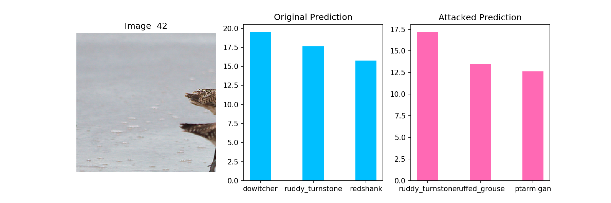
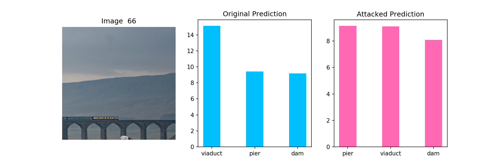
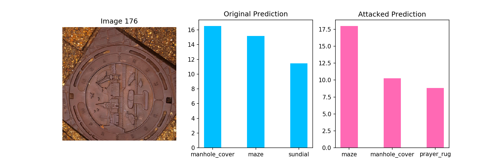

## Machine Learning 2019 Spring - HW3 Report

<h6 style="text-align: right">學號：B06902029	系級：資工二	姓名：裴梧鈞</h6>

1.  **(1%) 試說明 hw5_best.sh 攻擊的方法，包括使用的 proxy model、方法、參數等。此方法和 FGSM 的差異為何？如何影響你的結果？請完整討論。(依內容完整度給分)** 
    -   Proxy Model：使用 PyTorch 上的 ResNet50 作為我的 Proxy Model。
    -   方法：我使用 Iterative FGSM，即藉由不斷增加 $\epsilon$ 的值直到 Attack 成功。實作中我發現其實大部分的圖片都可以在 $\epsilon = 1, 2$ 的時候成功，因此即便有些照片無法在小的 $\epsilon$ 成功而需要用到較大的 $\epsilon$，他的 L-inf 也會被平均掉而讓我的 L-inf 可以落在 strong baseline 之內。
    -   與 FGSM 的差異：FGSM 的 $\epsilon$ 對於不同張的照片也是固定的，然而不同的照片所需的 $\epsilon$ 實際上是不一樣的，有些比較好攻擊，而有些比較難攻擊。因此，對於每張照片使用不同的 $\epsilon$ 會有比較好的結果。
2.  **(1%) 請列出 hw5_fgsm.sh 和 hw5_best.sh 的結果 (使用的 proxy model、success rate、L-inf. norm)。**

|      | Proxy Model | Success Rate | L-inf Norm |
| ---- | ----------- | ------------ | ---------- |
| FGSM | ResNet50    | 0.900        | 22.0000    |
| BEST | ResNet50    | 1.000        | 3.9550     |

3.  **(1%) 請嘗試不同的 proxy model，依照你的實作的結果來看，背後的 black box 最有可能為哪一個模型？請說明你的觀察和理由。**

    我使用過我在 FGSM 上實作六種可能的 Proxy Model，比較後發現 ResNet50 的表現是最好的。之後我也實作了比較 Success Rate 以及 L-inf Norm 的程式，發現以 ResNet50 作為黑箱 Model 得到的結果與 JudgeBoi 上得到的一樣。因此我猜想 ResNet50 就是黑箱 Model。

4.  **(1%) 請以 hw5_best.sh 的方法，visualize 任意三張圖片攻擊前後的機率圖 (分別取前三高的機率)。**

    -   Image042
        
    -   Image066
        
    -   Image176
        

5.  **(1%) 請將你產生出來的 adversarial img，以任一種 smoothing 的方式實作被動防禦 (passive defense)，觀察是否有效降低模型的誤判的比例。請說明你的方法，附上你防禦前後的 success rate，並簡要說明你的觀察。另外也請討論此防禦對原始圖片會有什麼影響。**

    我使用的方法是 Gaussian Blur，使用的套件是 `opencv`，參數是 `ksize = 5`。他會把原始圖檔模糊化，大部分的圖檔在模糊化之後仍然是肉眼可區分的，但會讓部分的原始圖片 Predict 出不一樣的結果。

    總體而言，雖然他讓攻擊成功的比例減少約 60%，卻也判斷錯了約 15% 的照片；至於這個 trade-off 是否可接受，我認為則要探討到原本的 task 的性質，在此不多做討論。

    | 圖片            | Success Rate |
    | --------------- | ------------ |
    | 攻擊圖檔        | 1.0          |
    | 攻擊圖檔做 Blur | 0.395        |
    | 原始圖檔做 Blur | 0.155        |

    