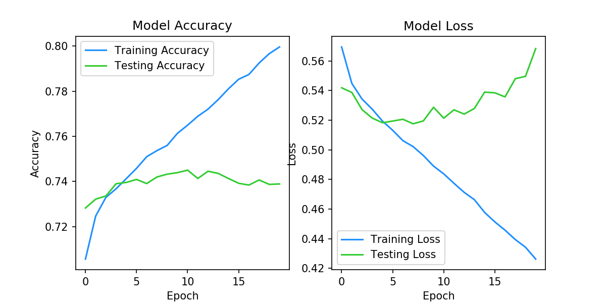
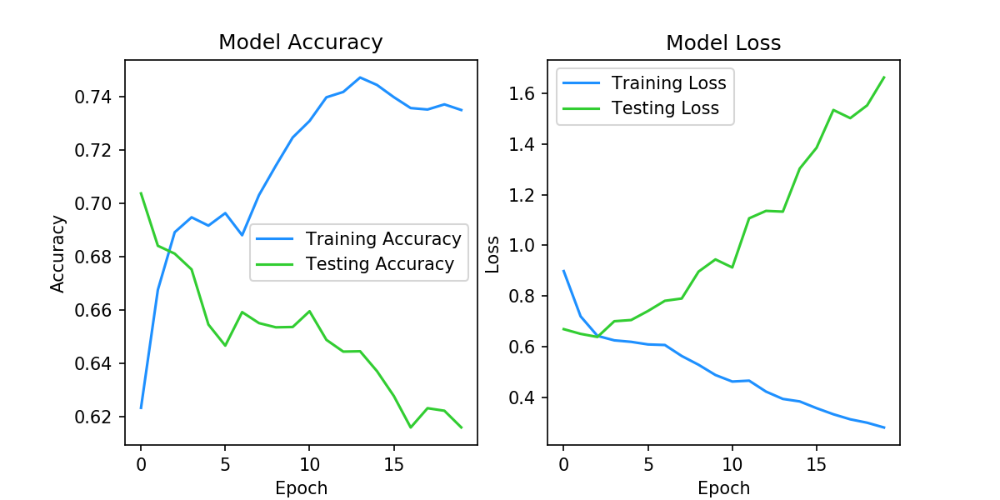

## Machine Learning 2019 Spring - HW6 Report

<h6 style="text-align: right">學號：B06902029	系級：資工二	姓名：裴梧鈞</h6>

1.  **(1%) 請說明你實作之 RNN 模型架構及使用的 word embedding 方法，回報模型的正確率並繪出訓練曲線。**

    -   RNN Model

        ```
        EmbeddingLayer
        Dropout(0.4)
        BidirectionalLSTM(128)
        Dropout(0.4)
        Dense(1)
        ```

    -   Word Embedding

        1.  使用 Jieba 進行分詞
        2.  Train 一個 Word2Vec 的 model 並算出 embedding matrix
        3.  藉由 embedding matrix 將輸入轉乘 model 的 input

    -   訓練曲線 (epoch = 20)
        

    -   正確率 (epoch = 10)
        為避免 overfitting 的發生，使用 10 個 epoch 的 model 作為繳交的 model。

        | Validation Accuracy | Public Score | Private Score |
        | ------------------- | ------------ | ------------- |
        | 0.7450              | 0.74230      | 0.73490       |

2.  **(1%) 請實作 BOW+DNN 模型，敘述你的模型架構，回報模型的正確率並繪出訓練曲線。**

    -   BOW

        為了避免因字典詞太多而造成維度過多、Memory Error 等問題，我僅使用出現次數十次以上的詞。出現次數十次以下的詞將被視為 0。

    -   DNN

        ```
        Dense(256)
        Dropout(0.4)
        Dense(16)
        Dropout(0.4)
        Dense(1)
        ```

    -   訓練曲線 (epoch = 20)
        

    -   正確率 (epoch = 3)
        與 Problem 1 相同，為避免 overfitting 的發生，使用 3 個 epoch 的 model 作為繳交的 model。

        | Validation Accuracy | Public Score | Private Score |
        | ------------------- | ------------ | ------------- |
        | 0.6878              | 0.72540      | 0.72380       |

3.  **(1%) 請敘述你如何 improve performance（preprocess, embedding, 架構等），並解釋為何這些做法可以使模型進步。**

    -   Preprocess & Jieba

        -   標點符號
            我發現分詞會切出標點符號，我覺得標點符號大部分的時候都沒有太大的用處，於是把以下全形標點符號以及空白刪除了。

            ```
            ，。？！～：（）
            ```

        -   英文大小寫
            雖然在 Dcard 的資料中英文出現的不多，但我還是把所有英文字串藉由 `str.lower()` 轉成小寫。如此一來可以讓詞的數量降低一點，而那些大小寫的英文詞的意思應該不會差太多，總體而言讓我的 model 表現略好一點。

    -   Embedding
        沒有做特別的更動，如果將 `trainable` 設成 `True`，則可以讓 Training 所需的 epoch 變小相當多（約 5 個 epoch 就到 validation loss 的最低了）。

    -   架構
        我有嘗試在 LSTM 的 Layer 前後加 Dense 的 Layer，發現這樣會讓 model 些為變好，但相當容易 overfit。

    -   Ensemble
        藉由以上所述幾點（特別是架構），我設計出一些 model，並藉由 Ensemble 預測。我的單一 Model 都不能過 Strong Baseline，Ensemble 起來有過 Strong 過，但是我把 Model 刪掉了沒辦法 Reproduce 回來......

4.  **(1%) 請比較不做斷詞 (e.g., 以字為單位) 與有做斷詞，兩種方法實作出來的效果差異，並解釋為何有此差別。**
    | Model     | Validation Accuracy | Public Score | Private Score |
    | --------- | ------------------- | ------------ | ------------- |
    | 分詞RNN   | 0.7450              | 0.74230      | 0.73490       |
| 分詞BOW   | 0.6878              | 0.72540      | 0.72380       |
    | 不分詞RNN | 0.7405              | 0.73830      | 0.73430       |
    | 不分詞BOW | 0.6725              | 0.70870      | 0.70760       |
    
    不分詞的 Model 大概略差於有分詞的 Model，Accuracy 大概差個 0.5 ~ 1.5 %，差距並不是很大。我認為最主要的問題是因為惡意言論可能都跟某些字／詞有關係，而我的 Model 則是藉由那些字／詞判斷是否為惡意言論。
    
5.  **(1%) 請比較 RNN 與 BOW 兩種不同 model 對於 "在說別人白痴之前，先想想自己"與"在說別人之前先想想自己，白痴" 這兩句話的分數（model output），並討論造成差異的原因。**

    | Model | 第一句 Output | 第二句 Output |
    | ----- | ------------- | ------------- |
    | RNN   | 0.76684       | 0.76656       |
    | BOW   | 0.78075       | 078075        |

    從表格可以發現 BOW 的結果和 RNN 的結果差不多，都是呈現這是惡意言論；另外，可以發現 BOW 的特性，句子組成相同（分詞結果相同）時，Input 的 vector 會一樣而導致兩個 Output 一樣。

    令我比較意外的是 RNN 的第一句 Output 略大於第二句的 Output，但就我的弱弱國文能力判斷來說，第一句其實比較沒有惡意的成分。這或許是因為 training data 之中較少這樣的句子或者 training data 將這類的語句標成惡意的 label 導致的。