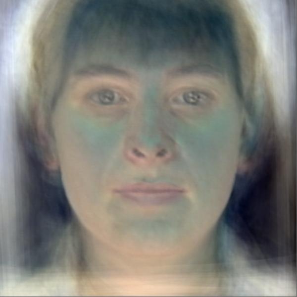

## Machine Learning 2019 Spring - HW7 Report

<h6 style="text-align: right">學號：B06902029	系級：資工二	姓名：裴梧鈞</h6>


1.  **PCA of color faces**

    **(a) 請畫出所有臉的平均。**

    

    **(b) 請畫出前五個 Eigenfaces，也就是對應到前五大 Eigenvalues 的 Eigenvectors。**

    | 編號 | 圖片                            |
    | ---- | ------------------------------- |
    | 0    |  |
    | 1    |  |
    | 2    |  |
    | 3    |  |
    | 4    |  |

    **(c) 請從數據集中挑出任意五張圖片，並用前五大 Eigenfaces 進行 reconstruction，並畫出結果。**
    | 編號 | 圖片                            |
    | ---- | ------------------------------- |
    | 0    |  |
    | 1    |  |
    | 2    |  |
    | 3    |  |
    | 4    |  |

    **(d) 請寫出前五大 Eigenfaces 各自所佔的比重，請用百分比表示並四捨五入到小數點後一位。**

    [4.1, 3.0, 2.4, 2.2, 2.1] (%)

2.  **Image clustering**
    **(a) 請實作兩種不同的方法，並比較其結果(reconstruction loss, accuracy)。(不同的降維方法或不同的 cluster 方法都可以算是不同的方法)**
    
    |                     | Autoencoder(16) + KMeans | Autoencoder(512) + PCA(32) + KMeans |
    | ------------------- | ------------------------ | ----------------------------------- |
    | Reconstruction Loss | 1.683032                 | 0.194105                            |
    | Accuracy            | 0.94364                  | 0.89070                             |
    
    **(b) 預測 visualization.npy 中的 label，在二維平面上視覺化 label 的分佈。**
    **(用 PCA, t-SNE 等工具把你抽出來的 feature 投影到二維，或簡單的取前兩維2的 feature)** 
    **其中visualization.npy 中前 2500 個 images 來自 dataset A，後 2500 個 images 來自 dataset B，比較和自己預測的 label 之間有何不同。**
    
    
    **(c) 請介紹你的model架構 (encoder, decoder, loss function...)，並選出任意32張圖片，比較原圖片以及用decoder reconstruct的結果。**
    
    -   Encoder
    
        ```
        Conv2d(32, (5, 5), stride = 2, padding = 2), ReLU
        Conv2d(64, (5, 5), stride = 2, padding = 2), ReLU
        Conv2d(96, (5, 5), stride = 2, padding = 2), ReLU
        Linear(96 * 4 * 4, 16)
        ```
    
    -   Decoder
    
        ```
        Linear(16, 96 * 4 * 4)
        ConvTranspose2d(96, (5, 5), stride = 2, padding = 2), ReLU
        ConvTranspose2d(64, (5, 5), stride = 2, padding = 2), ReLU
        ConvTranspose2d(32, (5, 5), stride = 2, padding = 2), ReLU
        ```
    
    -   Loss: MSE