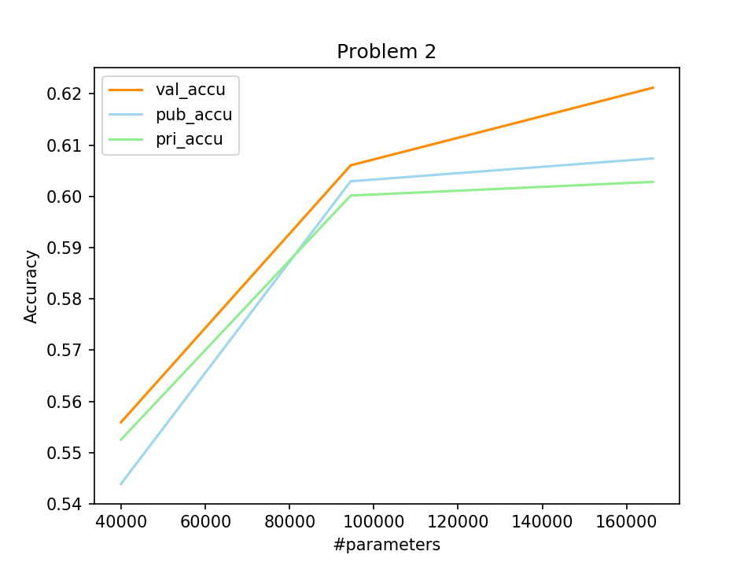
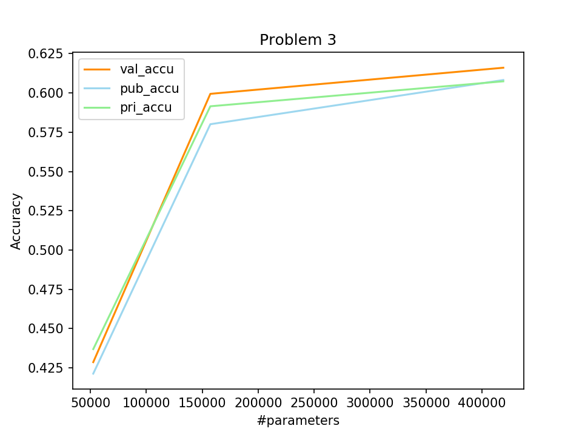

## Machine Learning 2019 Spring - HW8 Report

<h6 style="text-align: right">學號：B06902029	系級：資工二	姓名：裴梧鈞</h6>

1.  **請比較你本次作業的架構，參數量、結果和原HW3作業架構、參數量、結果做比較。(1%)**

    -   因為我在 kaggle deadline 之前一直無法 train 出一個過 strong baseline 的 model，因此以下所述的 model 是我在 kaggle deadline 之後 train 的一個 model，雖然也還是過不了 baseline。人生好難，pytorch 好難。

    -   架構

        -   `ConvBN(in, out, s)` = `Conv2d(in, out, kernel = 3, stride = s) + BatchNormalization + LeakyReLU(0.1)`
        -   `ConvDW(in, out, s)` = `Conv2d(in, in, kernel = 3, stride = s, group = in) + BatchNormalization + LeakyReLU(0.1) + Conv2d(in, out, kernel = 1, stride = 1) + BatchNormalization + LeakyReLU(0.1)`

        ```python
        ConvBN(1, 64, 1),       # 64 * 48 * 48
        
        ConvDW(64, 64, 1),
        ConvDW(64, 64, 1),
        ConvDW(64, 96, 2),      # 96 * 24 * 24
        
        ConvDW(96, 96, 1),
        ConvDW(96, 128, 2),     # 128 * 12 * 12
        Dropout(0.3),
        
        ConvDW(128, 128, 1),
        ConvDW(128, 128, 2),    # 128 * 6 * 6
        Dropout(0.3),
        
        AvgPool2d(3),           # 128 * 2 * 2
        
        Flatten(),              # 512
        
        Linear(512, 7),         # 7
        SoftMax()
        ```

    -   此次作業我也一樣使用 data augmentation，包括左右翻轉、旋轉 10 度以內、上下左右平移 0.1 以內、縮放 0.9 - 1.05 倍。

    -   比較

        | Model     | 參數量     | 使用 Convolution Layer 的數量 | 使用 Dense Layer 的數量 | Public Score | Private Score |
        | --------- | ---------- | ----------------------------- | ----------------------- | ------------ | ------------- |
        | MobileNet | 81,351     | 15                            | 1                       | 0.62385      | 0.62217       |
        | CNN       | 24,198,535 | 8                             | 5                       | 0.70771      | 0.69824       |

2.  **請使用MobileNet的架構，畫出參數量-acc的散布圖（橫軸為參數量，縱軸為accuracy，且至少3個點，參數量選擇時儘量不要離的太近，結果選擇只要大致收斂，不用train到最好沒關係。）(1%)**

  - 表格
    |      | 參數量  | Validation Accuracy | Public Score | Private Score |
    | ---- | ------- | ------------------- | ------------ | ------------- |
    | 1    | 39,911  | 0.555904            | 0.54388      | 0.55252       |
    | 2    | 94,471  | 0.606061            | 0.60295      | 0.60016       |
    | 3    | 16,6279 | 0.621212            | 0.60741      | 0.60824       |
    
  - 圖片
       


3.  **請使用一般CNN的架構，畫出參數量-acc的散布圖（橫軸為參數量，縱軸為accuracy，且至少3個點，參數量選擇時儘量不要離的太近，結果選擇只要大致收斂，不用train到最好沒關係。）(1%)**

  - 表格
    |      | 參數量  | Validation Accuracy | Public Score | Private Score |
    | ---- | ------- | ------------------- | ------------ | ------------- |
    | 1    | 52,567  | 0.428596            | 0.42128      | 0.43689       |
    | 2    | 157,223 | 0.599443            | 0.58010      | 0.59152       |
    | 3    | 419,047 | 0.616066            | 0.60824      | 0.60741       |
    
  - 圖片
      

4.  **請你比較題2和題3的結果，並請針對當參數量相當少的時候，如果兩者參數量相當，兩者的差異，以及你認為為什麼會造成這個原因。(2%)**
    本題將以第二題及第三題最少的參數量的 model 做討論，雖然參數量差了一萬多，但我覺得他們還是在同一個量級的（CNN 就算深度比較少參數量還是有可能比較多）。
    應該不難看出來 MobileNet 的表現相較於 CNN 的表現是好很多的，無論是 validation accuracy、public score、private score 都有大約 0.12-0.13 的差距。我認為主因是 MobileNet 在參數量少的時候仍可以建出深度足夠且 filter 數夠多的 model；而 CNN 在參數量少的時候必須要在深度及廣度中至少捨棄一項，因此 CNN 便沒辦法變得那麼 powerful。